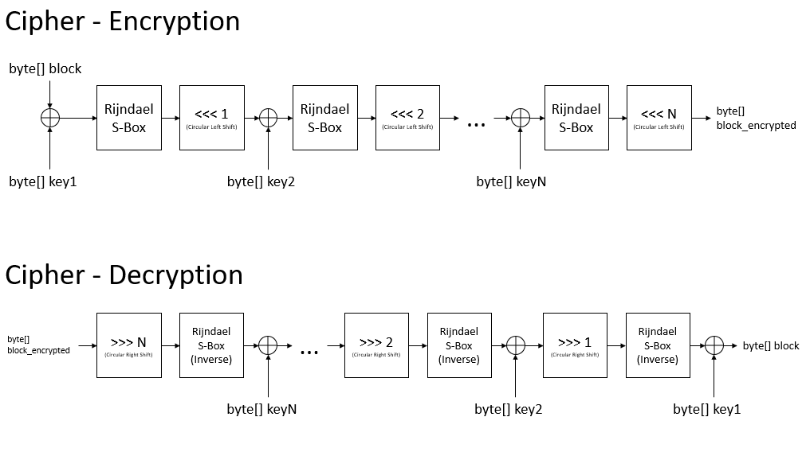

# Block-Cipher

Symmetric 48-bit block cipher in CBC mode.

Application developed as workpaper for the Information Theory class.
University of Vale do Rio dos Sinos, Brazil/Rio Grande do Sul

## How to run
* Open your terminal
* Go to the directory where the .jar (cipher.jar) file is stored
* In that directory run the .jar file
* Further information can be accessed inside the program by using the command <help>.

### Example:
* c:\> cd Desktop
* c:\Desktop> java -jar codec.jar

The application will open inside your terminal
  
## Additional info
The application works best with UTF-8 charset, files with different charsets might have issues in the output.

## Design diagrams

### Cipher Block Chaining (CBC)
The CBC algorithm follows the standard Cipher Block Chaining process. A xor operation is executed with the current block and the previous encrypted one, an initialization vector is used in the first block. After this step, the block goes through the Cipher encryption process with the keys generated by the Key Scheduler, the output is the encrypted block.
The decrypt process executes the logic in reverse.

### Key Scheduler
The Key Scheduler is responsible to expand the key provided by the user if necessary (less than 6 bytes) and generate the amount of keys defined in the project (8 keys). For each new key, the algorithm applies a fixed circular left shift (<<< 5) in the last one. The output is a byte matrix of keys.

### Cipher
The Cipher algorithm applies the following process to each block 8 times (amount of keys generated by the Key Scheduler).
* Executes a xor operation with the current key;
* Applies Rijndael S-Box (AES S-Box) as confusion step;
* Executes a circular left shift with the size set by the key index + 1 as diffusion step;

The decrypt process executes the logic in reverse.

